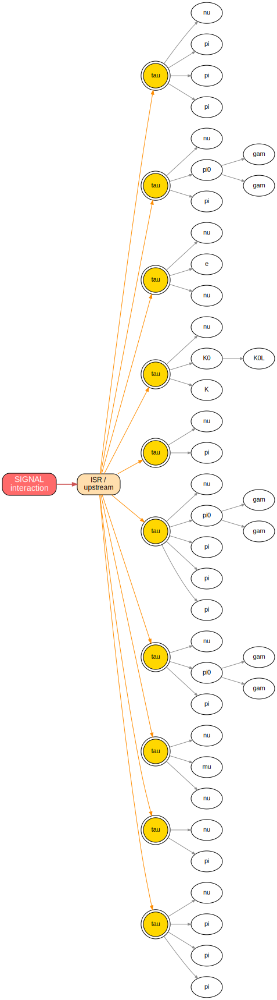
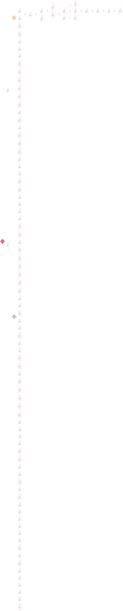

# Worked examples

Two concrete events, end to end: what the truth graph looks like, how the
selection picks out the interesting particles, and how the picture maps onto the
navigation API in [How to use the graph](usage.md). Both graphs are real renders
from the DOT gallery (`test/dot_gallery_v20`, generated by `makeTruthGallery.sh`;
see [Validation](validation.md)).

!!! note "How to read these graphs"
    The logical graph is **bipartite**: ellipses are `Particle`s, diamonds are
    `Vertex`es, and an arrow always alternates realm — particle → its decay
    vertex → its children. Node colour encodes provenance (the dumper's legend):

    - **blue** = GEN-only (generator particles/vertices with no SIM counterpart —
      e.g. neutrinos, intermediate resonances);
    - **red** (particles) = a merged GEN+SIM particle that Geant4 propagated far
      enough to record trajectory checkpoints — the charged, hit-leaving daughters;
    - **black** (particles) / **purple** (vertices) = merged GEN+SIM with no
      checkpoints; **darkgreen** = SIM-only.

    Each particle box carries its `pdgId`, `status`, four-momentum, parent/child
    counts, and its direct and subgraph hit tallies (calo and tracker) — exactly the
    fields the navigation and hit-index API expose. The graphs are tall; open the
    SVG and zoom.

## TenTau — ten taus with varied decays

`TenTau` (workflow `34087.88`) guns ten τ leptons (energy 15–500 GeV) into the
detector. The τ is the only lepton heavy enough to decay hadronically, so a single
gun gives a rich spread of final states in one event: leptonic τ → ℓ ν<sub>ℓ</sub>
ν<sub>τ</sub> (with ℓ = e or μ) and hadronic τ → (π<sup>±</sup>, π<sup>0</sup>, K…)
ν<sub>τ</sub>, in both 1-prong and 3-prong topologies. It is the natural stress
test for a truth graph: ten independent decay branches, each with its own
neutrinos (invisible energy), charged tracks, and electromagnetic/hadronic shower.

The image below is the GEN-level decay structure of one event — the ten taus and
their immediate decay products, before the Geant4 shower — with one deliberate
feature: **all ten taus descend from a single artificial "signal" interaction
vertex** (red, on the left). Each interaction is summarized by one `Interaction`
source vertex that fans out, through artificial connector particles, to an
`Upstream` (ISR / hard-scatter) vertex and — when there is one — an
`UnderlyingEvent` vertex; the ten taus hang off this event's Upstream node. That
single interaction vertex is what lets you say *exactly* what is signal and what is
not: the signal is, by definition, everything reachable from it. When pile-up is
overlaid, **each extra interaction gets its own Interaction vertex**, so signal vs
pile-up becomes a plain reachability test rather than a guess. (This TenTau gun has
no underlying event, so only the Upstream branch appears; the full *detectable*
logical graph has ~10<sup>4</sup> nodes once every hit-leaving shower secondary is
attached — the GEN core is the didactic part, and the [hit index](data-model.md)
links each particle to its detector footprint.)



What to look at:

- **One interaction vertex, then the upstream node, then ten τ branches.** The red
  box is the per-interaction `Interaction` vertex; the orange box is its `Upstream`
  child (reached through an artificial connector particle), and the Upstream node's
  ten outgoing edges are the ten τ particles (gold, pdgId ±15). All three artificial
  nodes carry the signal provenance (bunch crossing 0, event 0), so descending from
  the Interaction vertex enumerates the whole signal and nothing else.
- **The varied decay modes.** Following each τ to its decay products you find the
  full menu: hadronic τ → π<sup>±</sup> (π<sup>0</sup>, K…) ν<sub>τ</sub> in both
  1-prong and 3-prong topologies, plus a leptonic τ → μ ν<sub>μ</sub> ν<sub>τ</sub>
  and a τ → e ν<sub>e</sub> ν<sub>τ</sub>.
- **Neutrinos are the invisible leaves.** Every branch terminates in at least one
  **τ neutrino** (ν, pdgId ±16), plus a ν<sub>μ</sub>/ν<sub>e</sub> in the leptonic
  legs — leaves with no hits, exactly what `Branch::visibleP4()` excludes and
  `invisibleEnergy()` measures.

How the **Branch** selection produces this: the view is cut with
`seedPdgIds = {15, -15}`, `seedParentDepth = 0` and `keepStableSpectators = false`,
keeping each τ and its downstream subtree; with `attachSelectionSources = true`
(the default) the truncated upstream is summarized into the single per-interaction
Interaction → Upstream structure. With the standalone dumper that is

```bash
cmsRun dumpTruthGraphsFromGENSIMRECO_cfg.py file:step3.root \
       -s 15,-15 -d 0 --no-keepSpectators
```

(Pass `--no-attachSources` instead and each τ becomes a true root of its own,
giving ten *disjoint* subgraphs with no common vertex — useful when you want each
seed in isolation rather than a signal-vs-rest split.) In code each τ is one Branch;
ask it for its leaves and kinematics:

```cpp
truth::Branch tauBranch(&graph, tau.id());          // Subtree closure
auto leaves   = tauBranch.stableLeaves();           // the π/K/e/μ + ν
auto visP4    = tauBranch.visibleP4();              // sums leaves, drops the ν's
double eInvis = tauBranch.invisibleEnergy();        // carried by the τ neutrino(s)

// prong count = charged stable leaves (1-prong vs 3-prong); charge from the pdgId
// (the convention BranchSelector uses: HepPDT::ParticleID(pdgId).threeCharge())
int nProng = std::count_if(leaves.begin(), leaves.end(), [](truth::Particle const& p) {
  return HepPDT::ParticleID(p.pdgId()).threeCharge() != 0;
});
```

Each leaf's calorimeter and tracker hits are available through the
[hit index](usage.md#hit-content-and-matching-reco-objects)
(`subgraphHits` / `trackerSubgraphHits`), so the τ Branch carries the union of its
daughters' detector footprints — the basis for matching a reco jet or track back to
"which τ did this come from".

## ZMM — Z → μ⁺μ⁻, a clean two-muon signature

`ZMM` (workflow `34050.88`) is Z → μ<sup>+</sup>μ<sup>−</sup> at 14 TeV: two prompt,
high-p<sub>T</sub> muons and very little else. Muons are minimum-ionizing — they
leave a sparse string of tracker hits and almost no calorimeter shower — so this is
the opposite extreme from TenTau: a small, clean graph dominated by two long,
nearly-straight tracker trajectories.



What to look at:

- **One Z, two muons.** Seeding on the Z (`seedPdgIds = {23}`) the selected graph
  has the Z boson at its root, decaying at a single vertex into a μ<sup>−</sup> and
  a μ<sup>+</sup> (pdgId ∓13). With `seedParentDepth = 1` you also see the incoming
  partons (the blue status-21 `d`/anti-`d` quarks at the top) that produced the Z —
  the hard-scatter context.
- **The two muon branches are long and thin.** Each muon is a merged GEN+SIM
  particle that Geant4 propagated (red, with trajectory checkpoints), and its
  subtree is essentially itself plus a handful of delta-ray / bremsstrahlung
  secondaries. Read off the per-particle hit tallies: the muons carry tens of
  **tracker** subgraph hits (`nSubgraphTrackerSimHits`) and only a small **calo**
  energy — the textbook MIP signature, and why ZMM is a clean efficiency reference
  for the [tracker validators](validation.md#dqm-performance-plots-branch-vs-legacy-truth-objects).
- **Bipartite layout in miniature.** Because the event is sparse you can actually
  trace the full Particle → Vertex → Particle alternation by eye: Z (particle) →
  Z-decay vertex → μ<sup>+</sup>, μ<sup>−</sup> (particles), each μ → its own
  decay/interaction vertices → secondaries.

How this maps to the API: the two muons are exactly what
`graph.lowestCommonAncestor({muMinus, muPlus})` resolves to the Z, and a single
muon's tracker footprint feeds the
[reco-track matcher](usage.md#matching-an-arbitrary-reco-object-to-a-branch):

```cpp
truth::Particle muMinus = /* pdgId 13  */;
truth::Particle muPlus  = /* pdgId -13 */;

// "do these two tracks come from the same parent?" -> the Z
if (auto z = muMinus.firstCommonAncestor(muPlus); z && z->pdgId() == 23) { /* ... */ }

// match a reco::Track to the muon branch by shared tracker hits:
truth::BranchHitAssociator trk(hitIndex, /*roots=*/{},
                               truth::BranchHitAssociator::Metric::SharedHits,
                               /*useTracker=*/true);
auto best = trk.bestBranches(truth::recoHits(recoTrack));
```

This is the configuration the `BranchTrackRecoValidator` uses; restricting its
truth side to muons on ZMM gives a sensible reco-track efficiency (≈0.56) and a
near-zero merge rate, the clean reference case discussed in
[Validation](validation.md#reco-side-validators-generic-hit-exposure).

## Physics questions the interface answers

The point of the navigation API is that physics questions map onto a couple of
method calls. Each question below is answered with **real** methods from
[Graph.h / Branch.h](interface.md) — nothing invented. Assume `graph` is a
`truth::Graph const&` and `hitIndex` a `truth::LogicalGraphHitIndex const&`.

### "What is the first b-hadron ancestor of this particle?"

Walk up the ancestry to the nearest particle of a given species. There is no single
"any b hadron" pdgId, so either test the b quark, or scan ancestors with the
heavy-flavor helper used by `Branch`:

```cpp
truth::Particle p = graph.particle(id);

// nearest b quark in the ancestry (the hard-scatter b that started the jet):
if (auto bq = p.firstAncestorWithPdgId(5); bq.has_value())
  use(*bq);

// nearest b-flavored *hadron* ancestor (e.g. a B0 / B+ / Lambda_b):
for (truth::Particle a : p.ancestors()) {
  if (HepPDT::ParticleID(a.pdgId()).hasBottom()) { use(a); break; }
}
```

`p.hasAncestorPdgId(5)` is the cheap boolean form ("does this descend from a b
quark at all?").

### "Do these two particles share a common ancestor — same jet / same decay?"

Pairwise lowest common ancestor; the pdgId of the result tells you *what* they share:

```cpp
truth::Particle a = graph.particle(idA);
truth::Particle b = graph.particle(idB);

if (auto lca = a.firstCommonAncestor(b); lca.has_value()) {
  // lca->pdgId() == 23  -> both came from the same Z (e.g. the two ZMM muons)
  // lca->pdgId() == 15  -> both prongs of the same tau, etc.
}
```

For a whole set (the truth constituents of a reco jet), use the multi-source LCA on
the graph — "which particle did this jet come from":

```cpp
std::vector<truth::Particle> constituents = /* ... */;
if (auto origin = graph.lowestCommonAncestor(constituents); origin.has_value()) {
  if (auto top = origin->firstAncestorWithPdgId(6); top.has_value())
    use(*top);   // walk further up to the originating top
}
```

### "Which stable particles descend from this tau (and what is its visible energy)?"

Build a `Branch` from the tau and ask for its leaves and kinematics. The closure
controls how far down you go:

```cpp
truth::Particle tau = graph.particle(tauId);

truth::Branch branch(&graph, tau.id());          // full Subtree closure
auto leaves        = branch.stableLeaves();        // the pi/K/e/mu + neutrinos
auto visP4         = branch.visibleP4();           // sum of leaves, neutrinos removed
double eInvisible  = branch.invisibleEnergy();     // carried off by the tau neutrino(s)

// 1-prong vs 3-prong = number of charged stable leaves:
int nProng = std::count_if(leaves.begin(), leaves.end(), [](truth::Particle const& p) {
  return HepPDT::ParticleID(p.pdgId()).threeCharge() != 0;
});
```

To cut the tree off at the first hadrons instead of following the full shower, use a
different closure: `truth::Branch(&graph, tau.id(), truth::ClosureSpec::untilPdgId({211, -211, 111}))`.

### "Did this particle cross the calorimeter boundary, and with what momentum?"

Trajectory checkpoints are the Geant4 snapshots recorded along a propagated
particle. Only merged GEN+SIM particles that Geant4 tracked far enough carry them:

```cpp
truth::Particle mu = graph.particle(id);
if (mu.hasCheckpoints()) {
  for (truth::Checkpoint const& cp : mu.checkpoints()) {
    auto const& xAt = cp.position;   // math::XYZTLorentzVectorF where it was recorded
    auto const& pAt = cp.momentum;   // momentum at that surface
  }
  // or fetch a specific boundary by id:
  if (auto cp = mu.checkpoint(/*checkpointId=*/1); cp.has_value())
    use(cp->momentum);
}
```

### "Which generator process / which event produced this pileup particle?"

Provenance is per-branch and pile-up aware, decoded from the root's `EncodedEventId`:

```cpp
truth::Branch b(&graph, rootId);

if (b.isFromPileup()) {                 // bunchCrossing() != 0
  int bx       = b.bunchCrossing();     // out-of-time bunch crossing
  int evt      = b.event();             // which pile-up event in that crossing
  int32_t comp = b.genEvent();          // GEN connected-component id in the raw graph
}
bool isHardScatter = b.isSignal();      // bunchCrossing() == 0 && event() == 0
```

The same fields are on the artificial `Upstream` / `UnderlyingEvent` vertices
(`VertexData::genEvent` / `eventId`), so overlaid pile-up graphs stay
distinguishable.

### "Which truth particle does this reco object come from?"

Match the reco object's hits against branch subgraph footprints; the best match's
`rootParticleId` indexes back into the graph:

```cpp
truth::BranchHitAssociator calo(hitIndex);                 // SharedEnergy, calo channel
auto matches = calo.bestBranches(truth::recoHits(trackster, layerClusters), /*maxResults=*/1);
if (!matches.empty()) {
  truth::Particle origin = graph.particle(matches.front().rootParticleId);
  int32_t pdg = origin.pdgId();
}
```

For tracks, switch to the tracker channel and the shared-hit metric — see
[matching an arbitrary reco object](usage.md#matching-an-arbitrary-reco-object-to-a-branch).

### "Is this branch interesting — a charged, central, signal muon?"

`BranchSelector` is the one-line cut surface:

```cpp
truth::BranchSelector::Config cfg;
cfg.pdgIds = {13, -13};
cfg.ptMin = 1.0; cfg.etaMin = -2.4; cfg.etaMax = 2.4;
cfg.chargedOnly = true;
cfg.signalOnly  = true;
truth::BranchSelector select(cfg);

if (select(truth::Branch(&graph, rootId))) { /* keep it */ }
```

## Two extremes, one graph

TenTau and ZMM bracket what the graph has to handle: a dense, many-branch hadronic
event with deep showers, and a sparse two-track leptonic event. The same data model
— bipartite Particle ↔ Vertex CSR, on-demand `Branch` views, a per-particle hit
index — describes both, and the same navigation and matching API
([How to use the graph](usage.md)) works unchanged across the two.
