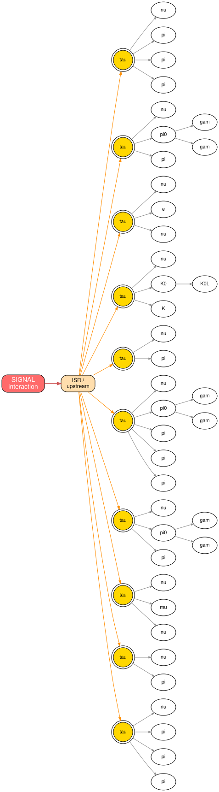
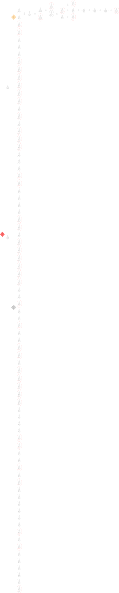
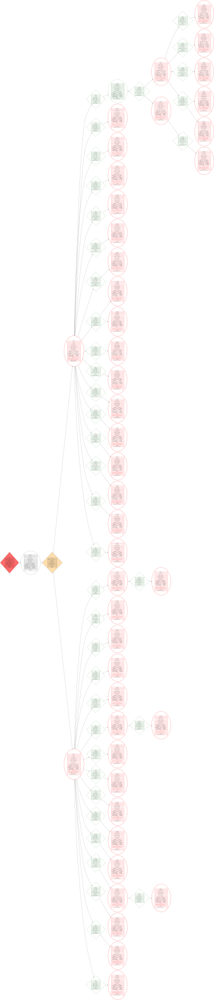

# Worked examples

The fastest way to understand the truth graph is to look at one. This page walks through three real events and reads the picture out loud: what each node is, why the selection kept it, and which call in the API would return it.

All three pictures are real renders from the graph gallery, not drawings. `makeTruthGallery.sh` produces them; see [Validation](validation.md).

!!! note "How to read these graphs"
    The truth graph is **bipartite**. Ellipses are `Particle`s and diamonds are
    `Vertex`es. An arrow always alternates realm: particle → its decay
    vertex → its children. Node colour encodes provenance. This is the dumper's
    legend:

    - **blue** = GEN-only: generator particles and vertices with no SIM
      counterpart, for example neutrinos and intermediate resonances;
    - **red** (particles) = a merged GEN+SIM particle that Geant4 propagated far
      enough to record trajectory checkpoints. These are the charged, hit-leaving
      daughters;
    - **black** (particles) and **purple** (vertices) = merged GEN+SIM with no
      checkpoints; **darkgreen** = SIM-only.

    Each particle box carries its `pdgId`, `status`, four-momentum, parent and
    child counts, and its direct and subgraph hit tallies for calo and tracker.
    These are exactly the fields that the navigation and hit-index API expose. The
    graphs are tall. Open the SVG and zoom.

## TenTau: ten taus with varied decays

`TenTau` (workflow `34087.88`) guns ten τ leptons into the detector, with energy
15 to 500 GeV. The τ is the only lepton heavy enough to decay hadronically. A
single gun therefore gives a rich spread of final states in one event. The
leptonic mode is τ → ℓ ν<sub>ℓ</sub> ν<sub>τ</sub>, with ℓ = e or μ. The hadronic
mode is τ → (π<sup>±</sup>, π<sup>0</sup>, K…) ν<sub>τ</sub>. Both appear in
1-prong and 3-prong topologies. This is the natural stress test for a truth graph.
It has ten independent decay branches. Each branch has its own neutrinos
(invisible energy), charged tracks, and electromagnetic or hadronic shower.

The image below shows the GEN-level decay structure of one event. It shows the ten
taus and their immediate decay products, before the Geant4 shower. It has one
deliberate feature: **all ten taus descend from a single artificial "signal"
interaction vertex** (red, on the left). One `Interaction` source vertex
summarizes each interaction. That vertex fans out through artificial connector
particles to an `InitialState` vertex, and to an
`UnderlyingEvent` vertex when there is one. The ten taus hang off the InitialState
node of this event. That single interaction vertex lets you say *exactly* what is
signal and what is not. The signal is, by definition, everything reachable from
it. With pileup overlaid, **each extra interaction gets its own Interaction
vertex**. Signal against pileup is then a plain reachability test rather than a
guess. (This TenTau gun has no underlying event, so only the InitialState branch
appears. The full *detectable* truth graph has ~10<sup>4</sup> nodes once every
hit-leaving shower secondary is attached. The GEN core is the didactic part, and
the [hit index](data-model.md) links each particle to its detector footprint.)



What to look at:

- **One interaction vertex, then the upstream node, then ten τ branches.** The red
  box is the per-interaction `Interaction` vertex. The orange box is its `InitialState`
  child, reached through an artificial connector particle. The ten outgoing edges
  of the InitialState node are the ten τ particles (gold, pdgId ±15). All three
  artificial nodes carry the signal provenance, that is bunch crossing 0 and event
  0. Descending from the Interaction vertex therefore enumerates the whole signal
  and nothing else.
- **The varied decay modes.** Follow each τ to its decay products and you find the
  full set. There is hadronic τ → π<sup>±</sup> (π<sup>0</sup>, K…) ν<sub>τ</sub>
  in both 1-prong and 3-prong topologies. There is also a leptonic
  τ → μ ν<sub>μ</sub> ν<sub>τ</sub> and a τ → e ν<sub>e</sub> ν<sub>τ</sub>.
- **Neutrinos are the invisible leaves.** Every branch terminates in at least one
  **τ neutrino** (ν, pdgId ±16). The leptonic legs add a ν<sub>μ</sub> or a
  ν<sub>e</sub>. These are leaves with no hits. They are exactly what
  `Branch::visibleP4()` excludes and what `invisibleEnergy()` measures.

This is how the **Branch** selection produces the picture. The cut is
`seedPdgIds = {15, -15}`, `seedParentDepth = 0` and `keepStableSpectators = false`.
It keeps each τ and its downstream subtree. With `attachSelectionSources = true`,
the default, the selection summarizes the truncated upstream into the single
per-interaction Interaction → InitialState structure. With the standalone dumper that
is

```bash
cmsRun dumpTruthGraphsFromGENSIMRECO_cfg.py file:step3.root \
       -s 15,-15 -d 0 --no-keepSpectators
```

(Pass `--no-attachSources` instead and each τ becomes a true root of its own. You
then get ten *disjoint* subgraphs with no common vertex. This is useful when you
want each seed in isolation rather than a signal-against-rest split.) In code each
τ is one Branch. Ask it for its leaves and kinematics:

```cpp
truth::Branch tauBranch(&graph, tau.id());          // Subtree closure
auto leaves   = tauBranch.stableLeaves();           // the π/K/e/μ + ν
auto visP4    = tauBranch.visibleP4();              // sums leaves, drops the ν's
double eInvis = tauBranch.invisibleEnergy();        // carried by the τ neutrino(s)

// prong count = charged stable leaves (1-prong vs 3-prong); charge from the pdgId
// (the convention BranchSelector uses: HepPDT::ParticleID(pdgId).threeCharge())
int nProng = std::count_if(leaves.begin(), leaves.end(), [](truth::Particle const& p) {
  return HepPDT::ParticleID(p.pdgId()).threeCharge() != 0;
});
```

The [hit index](usage.md#hit-content-and-matching-reco-objects) gives the
calorimeter and tracker hits of each leaf, through
`subgraphHits(HitChannel::Calo, …)` and `subgraphHits(HitChannel::Tracker, …)`.
The τ Branch therefore carries the union of the detector footprints of its
daughters. That is the basis for matching a reco jet or track back to
"which τ did this come from".

## ZMM: Z → μ⁺μ⁻, a clean two-muon signature

`ZMM` (workflow `34050.88`) is Z → μ<sup>+</sup>μ<sup>−</sup> at 14 TeV. It gives
two prompt, high-p<sub>T</sub> muons and very little else. Muons are
minimum-ionizing. They leave a sparse string of tracker hits and almost no
calorimeter shower. This sample is therefore the opposite extreme from TenTau. It
gives a small, clean truth graph dominated by two long, nearly-straight tracker
trajectories.



What to look at:

- **One Z, two muons.** Seed on the Z with `seedPdgIds = {23}`. The selected graph
  then has the Z boson at its root. The Z decays at a single vertex into a
  μ<sup>−</sup> and a μ<sup>+</sup> (pdgId ∓13). With `seedParentDepth = 1` you
  also see the incoming partons that produced the Z: the blue status-21 `d` and
  anti-`d` quarks. These give the hard-scatter context.
- **The signal interaction structure.** As in TenTau, the whole event descends from
  a single artificial **Interaction** vertex (red). It fans out through an
  **initial state** node, here the partons, and an **UnderlyingEvent** node, the
  spectators. These graph-internal nodes are not GEN or SIM. They therefore carry
  their own **`Internal`** domain and inherit the **primary-vertex 4-position** of
  the collision. Everything reachable from the Interaction vertex is, by
  definition, this signal interaction.
- **The two muon branches are long and thin.** Each muon is a merged GEN+SIM
  particle that Geant4 propagated (red, with trajectory checkpoints). Its subtree
  is essentially itself plus a few delta-ray and bremsstrahlung secondaries. Read
  off the per-particle hit tallies. The muons carry tens of **tracker** subgraph
  hits (`nSubgraphTrackerSimHits`) and only a small **calo** energy. That is the
  standard MIP signature. It is why ZMM is a clean efficiency reference for the
  [tracker validators](validation.md#dqm-performance-plots-branch-vs-legacy-truth-objects).
- **Bipartite layout in miniature.** The event is sparse, so you can trace the full
  Particle → Vertex → Particle alternation by eye. The chain is Z (particle) →
  Z-decay vertex → μ<sup>+</sup>, μ<sup>−</sup> (particles), and then each μ → its
  own decay and interaction vertices → secondaries.

This is how the picture maps to the API.
`muMinus.firstCommonAncestor(muPlus)` resolves the two muons to the Z.
The tracker footprint of a single muon feeds the
[reco-track matcher](usage.md#matching-an-arbitrary-reco-object-to-a-branch):

```cpp
truth::Particle muMinus = /* pdgId 13  */;
truth::Particle muPlus  = /* pdgId -13 */;

// "do these two tracks come from the same parent?" -> the Z
if (auto z = muMinus.firstCommonAncestor(muPlus); z && z->pdgId() == 23) { /* ... */ }

// match a reco::Track to the muon branch by shared tracker hits:
truth::BranchHitAssociator trk(hitIndex, /*roots=*/{},
                               truth::BranchHitAssociator::Metric::SharedHits,
                               truth::HitChannel::Tracker);
auto best = trk.bestBranches(truth::recoHits(recoTrack));
```

This is the configuration the track associators use.
[Validation](validation.md#the-hit-exposure-layer) describes the adapter layer.

## SingleElectron: an EM shower read off its vertex reasons

`SingleElectron` (workflow `34002.88`) fires one 35 GeV electron into the detector.
TenTau and ZMM exercise the GEN topology. This sample exercises the **SIM
cascade** instead. A single electron radiates, the photons convert, and the
products re-radiate. The detectable truth graph is therefore a deep
electromagnetic shower. Every SIM vertex now carries the **physical process that
created it** (`VertexData::vertexReason()`, see
[Data model](data-model.md#layer-2-truthgraph-logical)). The shower is therefore
self-describing.



What to look at (click to zoom):

- **Bremsstrahlung dominates.** Most branch points read `reason: Bremsstrahlung`,
  and this event has 27 of them. Each one is a photon radiated off the electron or
  off a shower secondary. It is the defining 1→2 vertex of an EM cascade.
- **Pair conversion turns photons back into pairs.** At a `reason: PairConversion`
  vertex a radiated γ materializes into an e⁺e⁻ pair. Alternating
  bremsstrahlung ↔ pair-conversion is exactly the shower-multiplication chain.
- **Annihilation and the hadronic tail.** `reason: Annihilation` marks an e⁺
  finding an e⁻, which gives back-to-back 511 keV γ's. A few
  `reason: HadronInelastic` vertices are the rare photonuclear and electronuclear
  interactions. They seed the small hadronic component of the shower.
- **Back-scattering.** Geant4 flags some secondaries as inward albedo across the
  CALO→Tracker boundary. These secondaries carry a **back-scattered** badge. They
  are the one class of particle whose distance from the production region
  *decreases*. They were historically the source of apparent history-reversal (see
  [Findings](findings.md)).

In code the reason is a plain enum on every vertex. You can therefore tag the
conversion points of a shower while you walk its members:

```cpp
int nConversions = 0;
for (truth::Particle p : branch.members())          // every shower particle
  for (truth::Vertex v : p.productionVertices())     // where it was created
    if (v.data().vertexReason() == truth::VertexReason::PairConversion)
      ++nConversions;                                // a gamma -> e+e- materialisation
```

## One analysis per selection preset, in python and in C++

`PhysicsTools/TruthInfo/test/presetExamples.py` and
`PhysicsTools/TruthInfo/test/TruthGraphPresetExamples.cc` hold the same ten analyses, one
per preset of `truthGraphSelections.py`, with the same function names. Each starts from
what its preset seeds on and prints one line per object of interest. They are the shortest
complete uses of the interface: the level helpers, `branchesAtLevel`, the provenance
accessors, `forEachChildId`, and the vertex positions.

| preset | what the example computes | from |
|---|---|---|
| `gun` | per gun particle: its reconstructable products and how many descendants reach the calorimeter | `signal`, `reconstructableFromSignal`, `caloBoundary` |
| `resonance` | the two leptonic legs of the Z and their invariant mass against the generator mass | `signal`, children |
| `vbf` | m(jj) and the rapidity gap of the two tagging quarks | `signal`, `partonJets` |
| `ggf` | the reconstructable products of the Higgs and the visible energy fraction | `signal`, `reconstructableFromSignal` |
| `vh` | the boson produced with the Higgs and its decay mode | production siblings |
| `top` | b and W of each top, the W mode, the event class | `signal`, `forEachChildId` |
| `singletop` | the production partner of the top | production siblings |
| `diboson` | m(VV) and the mode of each boson | `signal` |
| `heavyflavor` | flight length of each b hadron and the charm hadrons below it | `branchesAtLevel(BHadrons)`, vertex positions |
| `full` | per-interaction census, and the reconstructable final state with signal and pile-up apart | `summary()`, `isSignal` |

The python side reads the JSON the dumper writes, or an EDM file through FWLite:

```bash
presetExamples.py --preset resonance truthlogicalgraph_run1_lumi1_event26.json
presetExamples.py --preset all step3.root -n 2
```

The C++ side is a plugin driven by `presetExamples_cfg.py`. A production file holds the
graph with no selection preset, so `--rebuild` builds it again from the GEN and SIM record
in the file with the preset's selection; a gun takes its species from the fragment name:

```bash
cmsRun presetExamples_cfg.py step3.root --preset top --rebuild
cmsRun presetExamples_cfg.py step3.root --preset gun --rebuild --fragment TenTau_E_15_500
```

Both sides give the same numbers on the same events, which is the check that the python
reader and the C++ views agree. On the local samples (2026-09-17):

```
resonance 23 -> 11 -11: m(ll) 94.65 GeV, generator mass 94.66 GeV        (ZEE event 26)
vbf: 1 Higgs, tagging partons 2 1: m(jj) 611.1 GeV, |delta eta| 7.23     (VBF event 17)
top -6: b yes, W hadronic, 1262 descendants
top  6: b yes, W leptonic, 402 descendants
top event class: semileptonic                                             (TTbar event 38)
heavyflavor: 531 pt 101.76 GeV, flight 2.806 cm, 1 charm hadron below     (TTbar event 38)
gun 15 E 107.25 GeV: 2 reconstructable products, 105 descendants reach the calorimeter
```

`vh` printed nothing on the local samples: none of them is an associated-production
sample, and the example reports only a Higgs that shares its production vertex with a W
or a Z.

## Physics questions the interface answers

The point of the navigation API is that physics questions map onto a couple of
method calls. Each question below uses **real** methods from
[Graph.h / Branch.h](interface.md), with nothing invented. Assume `graph` is a
`truth::Graph const&` and `hitIndex` a `truth::LogicalGraphHitIndex const&`.

### "What is the first b-hadron ancestor of this particle?"

Walk up the ancestry to the nearest particle of a given species. There is no single
"any b hadron" pdgId. So either test the b quark, or scan the ancestors with the
heavy-flavor helper that `Branch` uses:

```cpp
truth::Particle p = graph.particle(id);

// nearest b quark in the ancestry (the hard-scatter b that started the jet):
if (auto bq = p.firstAncestorWithPdgId(5); bq.has_value())
  use(*bq);

// nearest b-flavored *hadron* ancestor (e.g. a B0 / B+ / Lambda_b):
for (truth::Particle a : p.ancestors()) {
  if (HepPDT::ParticleID(a.pdgId()).hasBottom()) { use(a); break; }
}
```

`p.hasAncestorPdgId(5)` is the cheap boolean form ("does this descend from a b
quark at all?").

### "Do these two particles share a common ancestor: same jet / same decay?"

This is the pairwise lowest common ancestor. The pdgId of the result tells you
*what* they share:

```cpp
truth::Particle a = graph.particle(idA);
truth::Particle b = graph.particle(idB);

if (auto lca = a.firstCommonAncestor(b); lca.has_value()) {
  // lca->pdgId() == 23  -> both came from the same Z (e.g. the two ZMM muons)
  // lca->pdgId() == 15  -> both prongs of the same tau, etc.
}
```

For a whole set, such as the truth constituents of a reco jet, use the
multi-source LCA on the truth graph. It answers "which particle did this jet come
from":

```cpp
std::vector<truth::Particle> constituents = /* ... */;
if (auto origin = graph.lowestCommonAncestor(constituents); origin.has_value()) {
  if (auto top = origin->firstAncestorWithPdgId(6); top.has_value())
    use(*top);   // walk further up to the originating top
}
```

### "Which stable particles descend from this tau (and what is its visible energy)?"

Build a `Branch` from the tau and ask for its leaves and kinematics. The closure
controls how far down you go:

```cpp
truth::Particle tau = graph.particle(tauId);

truth::Branch branch(&graph, tau.id());          // full Subtree closure
auto leaves        = branch.stableLeaves();        // the pi/K/e/mu + neutrinos
auto visP4         = branch.visibleP4();           // sum of leaves, neutrinos removed
double eInvisible  = branch.invisibleEnergy();     // carried off by the tau neutrino(s)

// 1-prong vs 3-prong = number of charged stable leaves:
int nProng = std::count_if(leaves.begin(), leaves.end(), [](truth::Particle const& p) {
  return HepPDT::ParticleID(p.pdgId()).threeCharge() != 0;
});
```

To cut the tree off at the first hadrons instead of following the full shower, use a
different closure. That closure is
`truth::Branch(&graph, tau.id(), truth::ClosureSpec::untilPdgId({211, -211, 111}))`.

### "Did this particle cross the calorimeter boundary, and with what momentum?"

Trajectory checkpoints are the snapshots that Geant4 records along a propagated
particle. Only merged GEN+SIM particles that Geant4 tracked far enough carry them:

```cpp
truth::Particle mu = graph.particle(id);
if (mu.hasCheckpoints()) {
  for (truth::Checkpoint const& cp : mu.checkpoints()) {
    auto const& xAt = cp.position;   // math::XYZTLorentzVectorF where it was recorded
    auto const& pAt = cp.momentum;   // momentum at that surface
  }
  // or fetch a specific boundary by id:
  if (auto cp = mu.checkpoint(/*checkpointId=*/1); cp.has_value())
    use(cp->momentum);
}
```

### "Which generator process / which event produced this pileup particle?"

Provenance is per-branch and pileup aware. `Branch` decodes it from the
`EncodedEventId` of the root:

```cpp
truth::Branch b(&graph, rootId);

if (b.isFromPileup()) {                 // !isSignal()
  int bx       = b.bunchCrossing();     // out-of-time bunch crossing
  int evt      = b.event();             // which pile-up event in that crossing
  int32_t comp = b.genEvent();          // GEN connected-component id in the raw graph
}
bool isHardScatter = b.isSignal();      // bunchCrossing() == 0 && event() == 0
```

The artificial `InitialState` and `UnderlyingEvent` vertices carry the same fields,
`VertexData::genEvent` and `eventId`. Overlaid pileup graphs therefore stay
distinguishable.

### "Which truth particle does this reco object come from?"

Match the hits of the reco object against the branch subgraph footprints. The
`rootParticleId` of the best match indexes back into the truth graph:

```cpp
truth::BranchHitAssociator calo(hitIndex);                 // SharedEnergy, calo channel
auto matches = calo.bestBranches(truth::recoHits(trackster, layerClusters), /*maxResults=*/1);
if (!matches.empty()) {
  truth::Particle origin = graph.particle(matches.front().rootParticleId);
  int32_t pdg = origin.pdgId();
}
```

For tracks, switch to the tracker channel and the shared-hit metric. See
[matching an arbitrary reco object](usage.md#matching-an-arbitrary-reco-object-to-a-branch).

### "Is this branch interesting: a charged, central, signal muon?"

`BranchSelector` is the one-line cut surface:

```cpp
truth::BranchSelector::Config cfg;
cfg.pdgIds = {13, -13};
cfg.ptMin = 1.0; cfg.etaMin = -2.4; cfg.etaMax = 2.4;
cfg.chargedOnly = true;
cfg.signalOnly  = true;
truth::BranchSelector select(cfg);

if (select(truth::Branch(&graph, rootId))) { /* keep it */ }
```

## Two extremes, one graph

TenTau and ZMM are the two extremes of what the truth graph has to handle. TenTau
is a dense, many-branch hadronic event with deep showers. ZMM is a sparse
two-track leptonic event. The same data model describes both: bipartite
Particle ↔ Vertex CSR, on-demand `Branch` views, and a per-particle hit index. The
same navigation and matching API ([How to use the graph](usage.md)) works
unchanged across the two.
