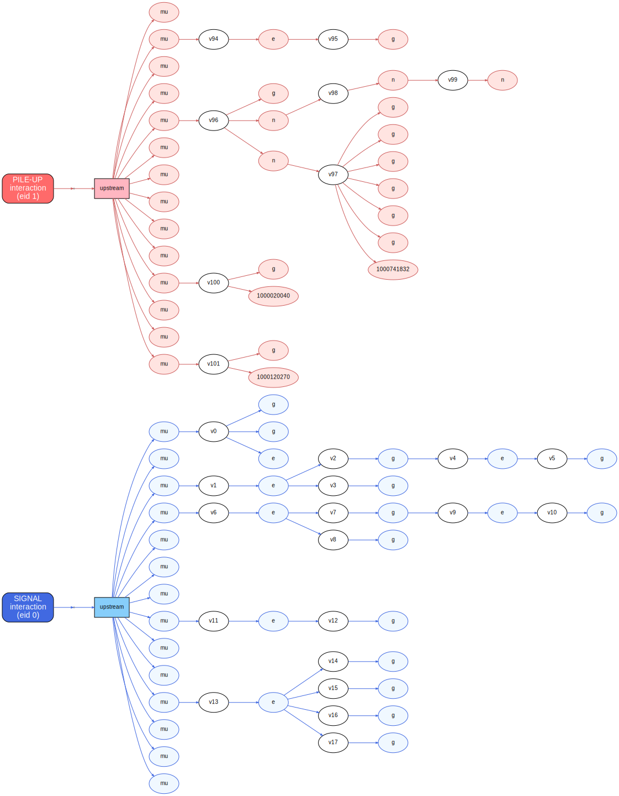

# Pileup

## The starting point: the graph was signal-only

The truth producers read `g4SimHits` / `generatorSmeared`, which are **signal
only** (bunch crossing 0). Pileup truth is elsewhere and mostly inaccessible:

- **Standard mixing:** pileup `SimTrack`s live in the **transient**
  `CrossingFrame<SimTrack>` — consumed by digitizers, never persisted (only
  `CrossingFramePlaybackInfoNew` survives). The only persisted pileup truth is the
  flat `mix:MergedTrackTruth` / `mix:MergedCaloTruth`.
- **Premixing:** pileup is overlaid at digi level; stage-2 exposes only
  `mixData:MergedTrackTruth` — no pileup `SimTrack`/`SimVertex`/HepMC at all.

Quantified on a PU=2 sample: `g4SimHits` SimTracks are 100% bx=0, while
`mix:MergedTrackTruth` is 91% pileup (bx≠0). The data model was *ready* for pileup
(every node carries an `EncodedEventId`; `Branch` exposes `isFromPileup`/
`bunchCrossing`; the artificial vertex roles were designed for overlaid pileup) —
the inputs just never delivered it.

## Two routes

### Phase A — `MixCollection` prototype

`TruthGraphMixedProducer` reads the `CrossingFrame<SimTrack/SimVertex>` via
`MixCollection`, keyed by `(EncodedEventId, localId)`. Because crossing frames are
transient, it must run **inside the DIGI step** (via the `addMixedTruthGraph`
customise, which enables the frames with `setCrossingFrameOn`); the compact mixed
graph is kept in the output.

It validated the data model on real mixed pileup — pileup visible across the whole
bunch-crossing window, signal isolated at `(bx=0, event=0)`, every track one
production vertex, no cycles — but **flattening the `MixCollection` fragments the
graph** (the local ids must be regrouped per sub-event, and a small fraction don't
re-resolve), giving ~1017 components/event. That weakness motivated Route B.

### Phase B — `TruthGraphAccumulator` (the production route, in progress)

A `DigiAccumulatorMixMod` (like `TrackingTruthAccumulator`). The framework feeds it
one sub-event at a time with its **native** `SimTrack`/`SimVertex`/HepMC
collections, so ids stay in their original local context — **no flattening, no
cross-pileup keying, no fragmentation**. It is identical for standard mixing and
premixing, and consistent with the digis by construction.

It is **configurable**:

| Parameter | Default | Meaning |
|---|---|---|
| `pileupBunchCrossings` | `{0}` | which bunch crossings to include for pileup (in-time only by default) |
| `collapsePileupGen` | `true` | for pileup, collapse the GEN chain to the stable particles on a single gen vertex, keep the SIM |
| `collapseSignalGen` | `false` | keep the signal's full graph (full signal GEN+SIM is the next step) |

The pileup default is exactly *"all the stable particles connected to the same gen
vertex — collapse the gen, keep the sim"*: one GEN vertex per pileup interaction
carrying all its stable (status-1) particles, with `GenToSim` links to the SIM
primaries and the SIM continuation kept.

## Results (PU=2, self-mixed TTbar, 3 events)

| Stage | bunch crossings | components/event | notes |
|---|---|---|---|
| Phase A (MixCollection) | −12 … +3 (all) | ~1017 | flatten+regroup fragments |
| B1 accumulator (SIM only) | bx 0 (filter) | ~47 | native per-sub-event linking (20× less) |
| B1 + collapsed pileup GEN | bx 0 | ~22 | gen vertex connects each interaction |

With the collapsed pileup GEN: 5 pileup gen vertices over 3 events, ~486 stable
particles per vertex, `GenToSim` merged ~2180 of them into their SIM primaries;
`multiProdParticles=0`, no cycles, pileup confined to bx 0 (the filter). The
`TruthGraphTopologyChecker` reports the full signal-vs-pileup per-bunch-crossing
breakdown used for these numbers.

!!! note "Self-mixing caveat"
    The PU input here is the TTbar signal itself (a quick, controllable mechanism
    test without an external minbias library), so the *counts* are heavy and not
    physical; the *mechanism* — provenance, bunch-crossing tagging, connectivity —
    is what is validated. Real minbias pileup is much lighter per interaction.

## Signal vs pile-up: how it is meant to separate

The truth graph separates signal from pile-up **by reachability**, not by a flag:
each interaction is summarized by its own artificial `Interaction` vertex (see the
[Interface reference](interface.md) and the [TenTau example](examples.md)), and
those vertices are keyed by the **packed `EncodedEventId`** — one node per pp
collision. So the signal is everything reachable from the signal Interaction vertex
(bunch crossing 0, event 0), and each pile-up interaction (distinct `EncodedEventId`)
gets its own Interaction vertex. The `truth::Particle::eventId` of every node carries
the same provenance, exactly what the `TruthGraphTopologyChecker` already decodes for
its signal-vs-pile-up per-bunch-crossing breakdown.

This works end to end. The accumulator stamps each node's `EncodedEventId`
(signal `(0,0)`, pile-up `(bunch crossing, pile-up index)`); the logical producer
copies it onto the SIM-bearing logical particle; it round-trips through the ROOT
dictionary (checked with FWLite); and the `Interaction`-vertex keying turns the
distinct ids into one Interaction vertex per interaction. Verified on a freshly
mixed TTbar event with in-time pile-up: the accumulator added the signal plus the
in-time pile-up sub-events with four distinct `EncodedEventId`s, and the logical
graph then reported `signalParticles = 27611`, `pileupParticles = 20616` — a clean
split, no graph changes needed.

The figure below is a muon-seeded view of that mixed graph
(`seedPdgIds = {13, -13}`, `dropHitlessSimSubgraphs = false`): the **blue** subgraph
descends from the signal Interaction vertex (`eid 0`), the **red** one from the
in-time pile-up interaction (`eid 1`). Signal vs pile-up is just "which Interaction
vertex do you reach".

Two practical notes:

- **The detectable-truth pruning must be turned off** for the mixed graph
  (`dropHitlessSimSubgraphs = false`): pile-up sim-hits live in the transient
  `CrossingFrame`, not in the signal `g4SimHits` collections the producer reads, so
  the pruning would otherwise drop the pile-up as "hitless".
- **The mixed sample must be produced with current code.** An older
  `test/pu_probe/step2_acc.root` predated the working provenance and read back
  signal-only (all `eventId == 0`). It has been regenerated from a clean build
  (full DIGI + in-time pile-up, 3 events) and now carries the provenance:
  `signalParticles = 69549`, `pileupParticles = 269076` across the three events.

## What remains

See the [Roadmap](roadmap.md): full GEN+SIM for the signal (factor the producer
build), the mixed hit index (B2), premix-library storage of the minbias graph (B3),
and a CPfromPU-style simplification for PU200 storage (B4).
